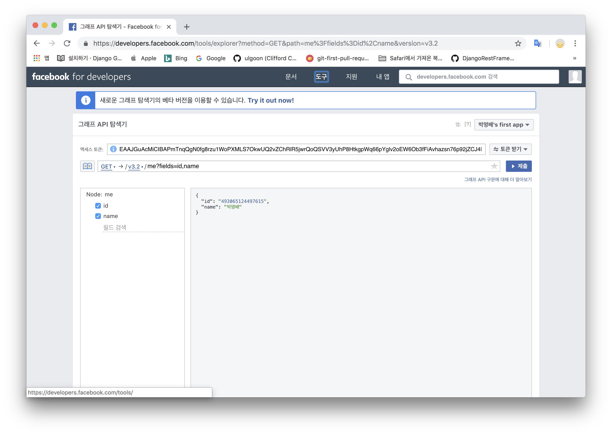

## OAuth

> Facebook for developer

* 사용자의 번거러움을 최소화

- 사용자
	* 웹 사이트 접속(Django)
	* 'Facebook 로그인'버튼 클릭
		* 페이스북 로그인이 안 되어 있다면 -> 페이스북 로그인 실행
		* 페이스북 로그인이 되어있다면 -> 다음 단계로
	* 웹 사이트(Django)의 유저가 됨
		* 자신의 페이스북 정보 중 일부가 유저정보에 들어가 있음

이 과정의 주체

1. 웹 사이트(Consumer, 소비자) -> Django가 속함
2. 사용자(User) -> 웹 사이트의 사용자(페이스북도 사용)
3. 페이스북(Service provider)

...

##### 상세 (가입)
* 웹 사이트 A에 사용자가 접속
* 페이스북으로 로그인 버튼 클릭
* Django가 사용자를 페이스북에게 넘겨줌
	* 우리(`django`)가 너의(`User`)정보를 쓸 건데 페이스북에서 `허용`을 해주길 원함
	* `facebook.com/<로그인 관련>/<특정 APP ID>/`
* 사용자가 페이스북에서 해당 내용에 대해 허용
	* 페이스북이 Django에게 특정 `토큰`을 넘겨줌
		* `토큰` : `특정 페이스북 사용자`의 `특정 권한`에 접근할 수 있는 `키`
* Django는 `토큰`을 사용해서 `User`의 정보를 가져와서 자신의 서비스의 DjangoUser를 생성하는데 사용
	* 인증에 사용하는 값은 `facebook user의 특정 값` <- `토큰`을 사용해서만 알아낼 수 있음

##### 상세 (로그인)
* 웹 사이트 A에 사용자가 접속
* 페이스북으로 로그인 버튼 클릭
* Django가 사용자를 페이스북에게 넘겨줌
	* 위의 내용은 모두 같음(`토큰을 받아옴`)
* `토큰`을 받아온 뒤, 토큰을 사용해서, `User`의 정보를 가져와서 이미 Django가 가지고 있는 DjangoUser의 값과 페이스북 User의 값을 비교

##### 이 로그인의 방식에는 비밀번호를 가지지 않는다.

## request_token,  access\_token

* Django -> Facebook => request_token을 요청
* Facebook -> Django => request_token 발급
* Django가 User를 Facebook으로 이동시킴 <- 여기서 사용자 인증이 수행됨
* Facebook이 User를 Django로 이동시킴
* Django가 access_token을 요청
* Facebook이 access_token을 발급
* 발급된 access_token을 이용해서 Django에서 User 정보에 접근

### Facebook Login

a tag를 이용해 아래 주소로 보내줌

```
https://www.facebook.com/v3.2/dialog/oauth?

  client_id={app-id}
  
  &redirect_uri={"https://www.domain.com/login"}
  
  &state={"{st=state123abc,ds=123456789}"}
```

* client_id : Facebook페이지의 my app
* redirect_uri : django url(요청 후 돌아올 url)

이 링크를 이용하면 Request_token을 받음

##### 받은 request_token을 적절히 이용해 access\_token을 만들어야 함

* access_token을 받기위한 과정

```
https://graph.facebook.com/v3.2/oauth/access_token?
   client_id={app-id}
   &redirect_uri={redirect-uri}
   &client_secret={app-secret}
   &code={code-parameter}
```

code : request_token

위 코드의 응답은 `JSON`형식으로 온다.

##### JSON

* `속성`-`값` 쌍으로 이루어진 데이터 오브젝트(객체)를 전달하기 위해 인간이 읽을 수 있는 텍스트를 사용하는 `개방형 표준` 포맷
* 서버쪽에서 보내기도 쉽고 파싱하기도 쉬움

access_token의 응답은 String객체

만약 이 String객체가 JSON형태로 되어있으면, 이 데이터를 파이썬 객체로 변환할 수 있음

`json.loads()`를 사용하면 인수로 온 문자열이 json형식일거라 생각하고, python object로 변환(dict)


* json.loads()를 간단하게 쓴다면

```
response.json()
```

* reponse로 번역된 결과물을 바로 파이썬 객체로 변환

## 그래프 API
> Facebook쪽에서 정보를 가져오거나 행동을 할 수 있음

* 노드 : 개별 개체
* 에지 : 개체와 개체간의 연결
* 필드 : 개체에 대한 데이터

* access_token을 이용하여 그래프 API를 이용할 수 있다.
 
<a href="https://developers.facebook.com/tools/explorer">-test tool-</a>



* me = 노드(access_token에 해당하는 유저)
* fields = 필드

User를 	요청하기 위한코드

```
graph.facebook.com/v3.2/{me}/
```

* access_token을 위의 주소로 `get`방식으로 보냄
* `io` : input/out
	* open : 실제로 존재하는 파일을 다룸
	* BytesIO : 실제 파일론 존재하진않음(메모리에 존재)

facebook login logic

```

def facebook_login(request):
    # request token
    api_base = 'https://graph.facebook.com/v3.2/'
    api_get_access_token = f'{api_base}/oauth/access_token'
    api_me = f'{api_base}/me'
    code = request.GET['code']
    params  = {
        'client_id': '2270191476551895',
        'redirect_uri': 'http://localhost:8000/members/facebook-login/',
        # 'client_secret': {secret}
        'code': code

    }
    # request token을 access token으로 교환
    response = requests.get(api_get_access_token, params)
    # 인수로 전달한 문자열이 `JSON`형식일 것으로 생각
    # json.loads는 전달한 문자열이 JSON일 경우, 해당 문자열을 parsing해서 python 객체로 변환
    data = response.json()
    access_token = data['access_token']
    params = {
        'access_token': access_token,
        'fields': ','.join([
            'id',
            'name',
            # 프로필 사진을 원본크기로
            'picture.type(large)',
        ])
    }
    # access_token을 이용해 data를 받음
    response = request.get(api_me, params)
    data = response.json()

    # api_me로 get요청을 보내 받은 response의 data
    facebook_id = data['id']
    first_name = data['first_name']
    last_name = data['last_name']
    url_img_profile = data['picture']['data']['url']
    # 이미지 url로 get요청을 보내 img를 가져옴
    img_response = request.get(url_img_profile)
    # FileField가 지원하는 InMemoryUploadedFile객체 사용
    img_data = img_response.content
    # 확장자를 가져오기 위한 패키지
    ext = imghdr.what('', h=img_data)
    # Form에서 업로드한 것과 같은 형태의 file-like object생성
    #  첫 번째 인수로 반드시 파일명이 필요. <facebook_id>.<확장자>형태의 파일명을 지
    f = SimpleUploadedFile(f'{facebook_id}.{ext}', img_response.content)

    try:
        user = User.objects.get(username=facebook_id)
        # update_or_create
        # facebook_id를 제외한 모든 필드는 facebook에서 수정될 때마다 갱신
        user.last_name = last_name
        user.first_name = first_name
        user.img_profile = f
        user.seve()
    except User.DoesNotExist:
        user = User.objects.create_user(
            username=facebook_id,
            first_name=first_name,
            last_name=last_name,
            img_profile=f,
        )
    login(request, user)

    return redirect('posts:post_list')

```